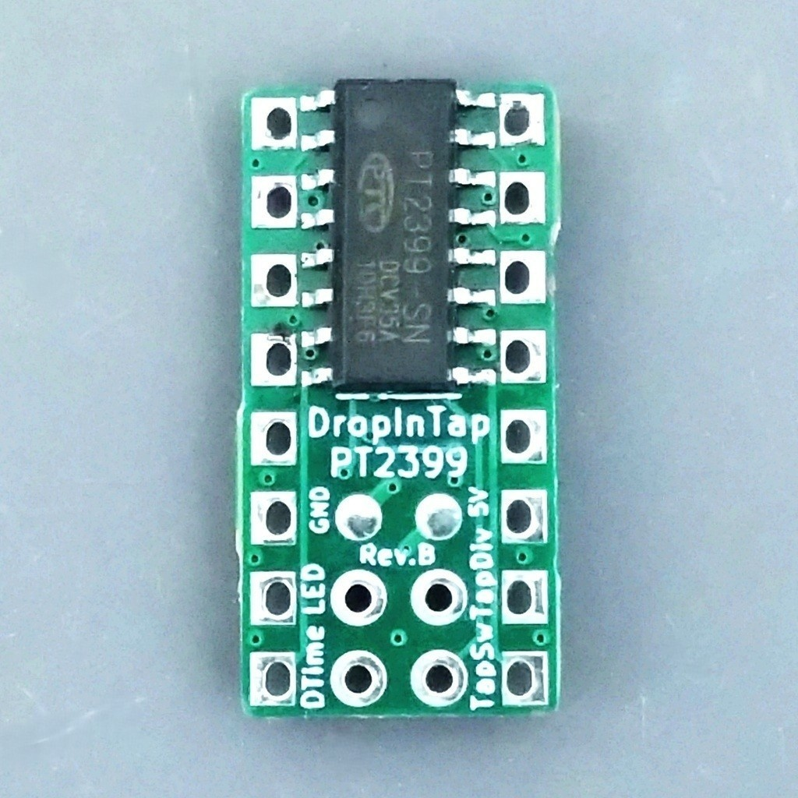
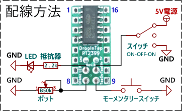

# DropInTap PT2399

 

ディレイIC PT2399にタップテンポコントロールを追加したモジュールです。DIPパッケージのPT2399をそのまま置き換えることができます。

[販売ページはこちら](https://kanengomibako.booth.pm/items/7034304)

### 配線方法

 

- DTime → ディレイタイムポット（50kΩ Bカーブ）

- TapDiv → スイッチ（ON-OFF-ON タイプ）

- LED → LEDと電流制限抵抗

  設定したテンポに合わせて5Vが出力されます。電流制限抵抗の抵抗値は470Ω以上を推奨します。LEDの点滅はノイズ源となるので、エフェクターの入力部を近づけないよう取り付け位置や配線に注意してください。

- TapSw → スイッチ

  モーメンタリー（モメンタリ）のスイッチを使用します。SPST（単極単投、1回路1接点）のものが入手しやすいです。

基板上の5VおよびGNDパッドは、それぞれ電源およびグラウンドに接続されています。配線時にはこれらのパッドを利用できます。その他の四角形のパッドは、通常のPT2399と同様に扱ってください。なお、基板上にPT2399が実装されている側が上側（トップ面）です。

※ 基板上のピン番号6に相当するパッドはどこにも接続されていません。ディレイタイムの設定には、DTimeパッドのみ使用してください。

### タップテンポ入力
TapSwパッドに接続されたスイッチ（タップスイッチ）を複数回押下（タップ）すると、タップの間隔に応じたテンポが入力されます。タップは直近5回分が記録され、タップ間隔の平均値によりテンポが決まります。TapDivパッドに接続されたスイッチ（DIVスイッチ）の接続状態により、テンポを基準としたディレイタイムが1/2、3/4、または1倍に分割され設定されます。

| DIVスイッチ接続    | 割合  | 拍                                           |
| ------------------ | ----- | -------------------------------------------- |
| 電源（5V）         | 1 / 2 |       |
| オープン（未接続） | 3 / 4 |  |
| グラウンド（0V）   | 1 / 1 |         |

前回のタップから1秒以上間隔があいてタップした場合、そのタップは1回目としてカウントされます。タップを1回だけ行った場合、LEDの点滅タイミングだけがリセットされ、前回入力していたテンポがそのまま残ります。

### ディレイタイムポット

DTimeパッドに接続されたポット（ディレイタイムポット）を動かすとタップテンポ入力が解除され、ディレイタイムポットによりディレイタイムが設定される状態となります。ディレイタイムポットの抵抗値が50kΩより小さい場合は最大ディレイタイムが少なくなりますので、抵抗値のばらつきにご注意ください。

### LED点滅設定
タップテンポ入力が有効な場合、テンポに合わせて常にLEDが点滅します。ディレイタイムポットでディレイタイムを設定している場合にも、ディレイタイムに応じてLEDを点滅させる機能があります（初期設定は無効）。下記の操作で有効・無効の切り替えができます。

- タップスイッチを押しながら電源を入れ、そのままタップスイッチを押し続けます。3秒経過するとLEDが点灯するので、タップスイッチを離します。設定が変更、保存され、LEDが2回点滅します。

### キャリブレーション

部品の誤差や個体差により入力したテンポとディレイタイムにずれが生じるため、キャリブレーションによる補正が必要です。出荷時には、温度24℃付近、電源電圧5Vの条件でキャリブレーションを行っています。温度や電圧の条件が違う環境で使用する場合には、下記の操作によりキャリブレーションを行ってください。**<u>キャリブレーション中は大きな音が発生するため、必ずエフェクトオフ、ディレイ音を最小音量にしてください。</u>**

- タップスイッチを押しながら電源を入れ、そのままタップスイッチを押し続けます。3秒経過するとLEDが点灯し、さらに3秒経過でLEDの明るさが弱くなるので、それを待ってからタップスイッチを離します。キャリブレーションが実行され、LEDが小刻みに点滅します。この間、タップスイッチを操作しないでください。約30秒でキャリブレーションが終了し校正値が保存され、通常動作になります。LEDが点灯し続けた場合、何らかのエラーが発生しているので電源を入れ直してください。

### 資料
- [DropInTap PT2399 製作に関する記事]()（準備中）

| 主な仕様 |  |
| - | - |
| ディレイタイム設定範囲 | 55 ミリ秒 ～ 700 ミリ秒 |
| タップテンポ精度 | ±2 ミリ秒未満（電源 5 V、温度 24 ℃） |
| 電源電圧 | 5 V（4.6 V ～ 5.4 V で使用可能） |
| 消費電流 | 30 mA |
| 外形寸法 | 幅 10.3 mm × 奥行 20.5 mm × 高さ 3.8 mm |
| 質量 | （準備中） |
